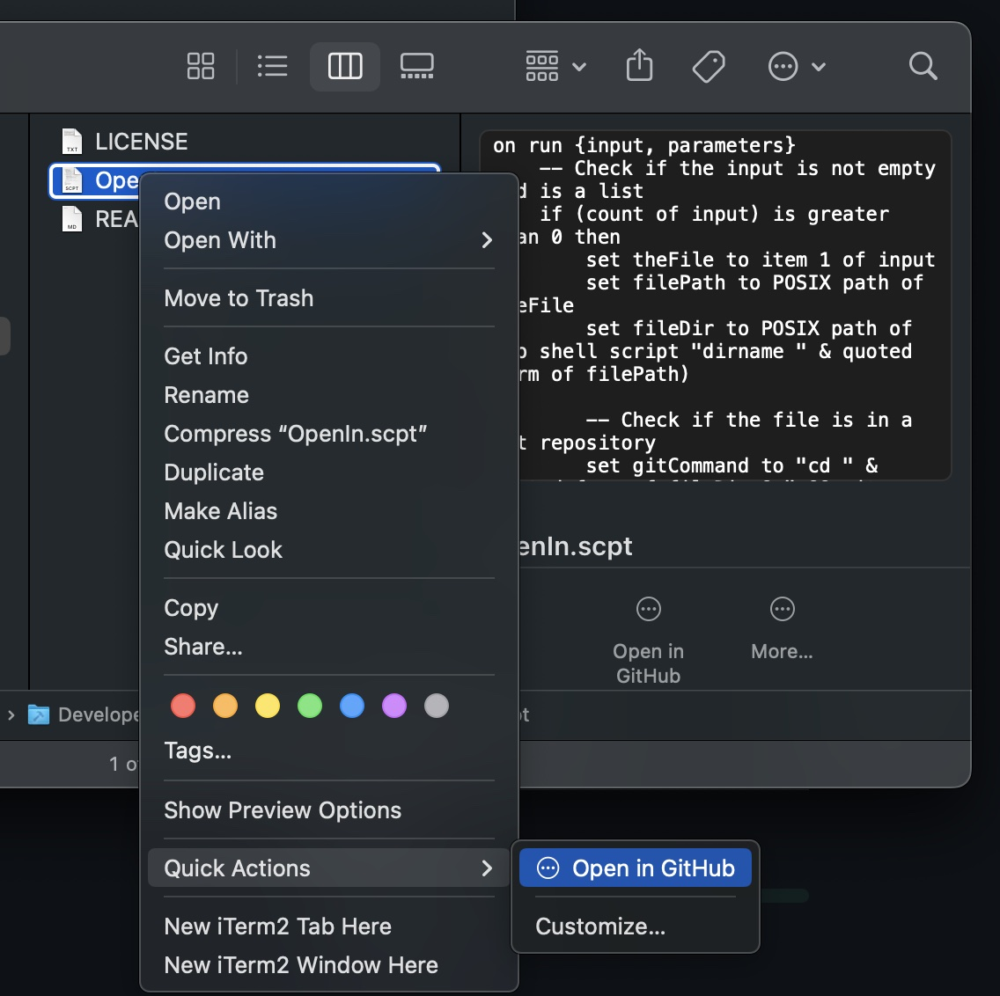

# Open In GitHub - macOS Quick Action

## Overview

"Open In GitHub" is a macOS Quick Action that allows you to quickly open a selected file in your GitHub repository directly from Finder. This convenient contextual menu item streamlines your workflow by eliminating the need to manually navigate to GitHub and search for the file.

## Features

- **Contextual Menu Integration**: Easily access the "Open in GitHub" option by right-clicking on any file in Finder.
- **Direct Navigation**: Automatically opens the selected file in your GitHub repository in your default web browser.

## Installation

1. **Download the Quick Action**: Go to the [latest release page](https://github.com/Bunn/Open-In-Github/releases) and download the Quick Action file.
2. **Install the Quick Action**: Double-click on the downloaded file to install it.

## Usage

1. Navigate to Finder and select the file you want to open in GitHub.
2. Right-click on the selected file.
3. Choose "Open in GitHub" from the contextual menu.
4. Your default web browser will open, displaying the file in your GitHub repository.

## Screenshot

